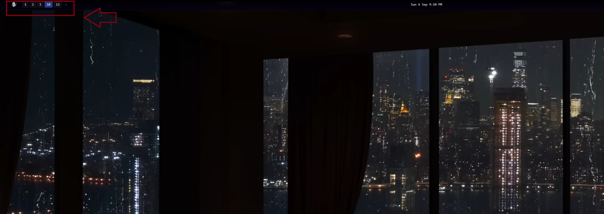
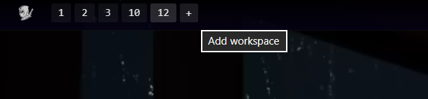

# Ninja

A tiling window manager for Windows, unified with a built-in status bar.



Good design eliminates the unnecessary. Ninja arranges windows systematically and provides precise keyboard navigation. The status bar—displaying workspaces, system metrics, media, and the system tray—operates within the same process as the window manager. One installation. One execution. No redundancy.

## Provenance
Ninja is a deliberate evolution of GlazeWM, with Zebar integrated directly into its core. It builds upon established foundations to reduce system fragmentation and simplify the user environment.



## Implementation

**Installation**
Execution of `ninja-setup.exe` — from the Releases page, or produced at `out/ninja-setup.exe` by the build below — installs the application to `C:\Program Files\Ninja`. It configures the system path and provisions the WebView2 runtime only if required. Removal is handled cleanly through standard system utilities.

**Configuration**
Control is centralized and transparent. The primary configuration resides at `~/.ninja/config.yaml`, generated from a precise template upon first execution.

| Path | Function |
| :--- | :--- |
| `~/.ninja/config.yaml` | Keybindings, spatial gaps, window rules, workspaces. |
| `~/.ninja/workspaces.json` | Runtime workspace states, preserved across sessions. |
| `~/.ninja/errors.log.<date>` | Daily rotated diagnostic logs. |
| `~/.ninja/bar/` | Status bar settings and widget modules. |

Alternative configuration paths are supported via command-line arguments (`ninja start --config <path>`) or environment variables (`NINJA_CONFIG_PATH`). Legacy configurations from `~/.glzr/` are migrated automatically and non-destructively on first run.


## Compilation

For those who require modification from the source.

**Prerequisites**
- Rust toolchain (managed via `rust-toolchain.toml`)
- pnpm (v9)
- WiX Toolset CLI (with `UI`, `Util`, and `BootstrapperApplications` extensions)
- Windows SDK (for `signtool.exe`)

**Process**
Execute the following from an elevated PowerShell:
```powershell
pnpm --dir bar install
./resources/scripts/dev-cert.ps1          # Required once for local signing
./resources/scripts/package.ps1 -VersionNumber 0.3.0 -DevSign
```
This produces `out/ninja-setup.exe` and the core executables in `out/x64`.

**Integrity and Signing**
Code signing is a functional requirement, not merely a formality. Windows grants UIAccess privileges only to signed binaries, which is necessary for Ninja to manage windows owned by elevated processes. The packaging script gracefully disables this feature if no signing certificate is present, allowing the unsigned build to remain operational for standard tasks.

## Development

The `./run.ps1` script compiles and initiates the application. It prioritizes a local test configuration (`.testconfig/config.yaml`) if available, falling back to the user configuration. Execution is cleanly terminated with the `-Stop` flag.

## Structure

The system is modular, ensuring each component serves a distinct, singular purpose.

| Component | Function |
| :--- | :--- |
| `ninja` | The unified application. Hosts the bar and window manager, manages the Tauri build, and produces `ninja.exe`. |
| `wm` | Core window management logic. Operates strictly as a library. |
| `wm-cli` | The `ninja-cli` command-line interface. |
| `wm-common` | Shared types and path resolution helpers. |
| `wm-ipc-client` | Client for the window manager's IPC endpoint. |
| `wm-platform` | Isolated operating system API wrappers. No other component interacts with the OS directly. |
| `wm-watcher` | Watchdog process for state recovery in the event of a crash. |

The bar's frontend resides in `bar/packages/client-api` and `bar/packages/settings-ui`. Both are compiled prior to the Rust build and embedded directly into the application.

## Extension

Widgets are constructed from plain HTML, interfacing directly with the served client API:
```js
import * as ninja from '/__ninja/client.js';
```

A starter pack is installed on first run to provide a clear foundation. The architecture maintains strict backward compatibility with existing Zebar widget packs: legacy routes, global states, and provider types remain fully supported, respecting prior user investment.

## License

GPL-3.0-only. Sorry, I would make it MIT but its a fork of GlazeWM which is GPL.

2026 - Z3n Agentic Systems.
